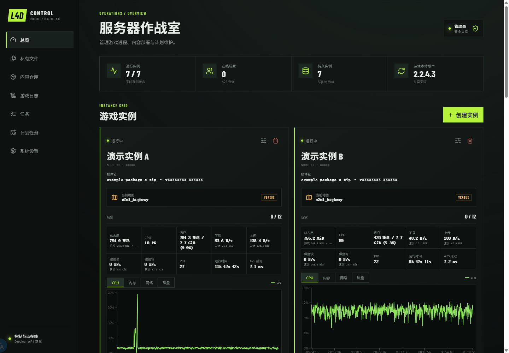
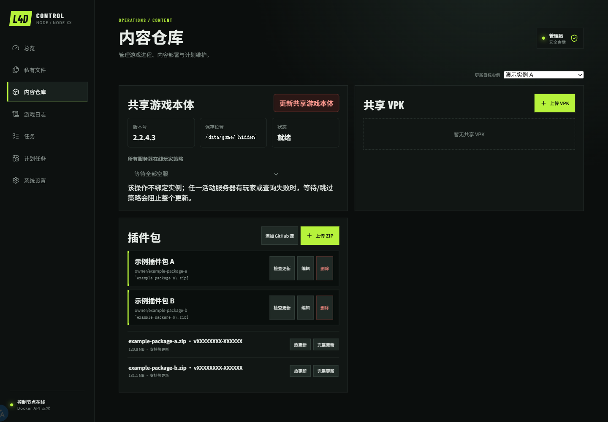

# L4D2 Control Panel

面向单台 Linux 主机、单管理员的 Left 4 Dead 2 专用服务器控制面板。Go 服务负责实例状态、SQLite 数据、后台任务、内容部署、A2S 查询和原生控制台连接，React 页面提供实例、玩家、文件、更新、日志与计划任务管理。

项目默认采用受限 Docker Socket 代理，不会把 `/var/run/docker.sock` 挂载到 Panel；游戏实例以非特权用户运行，并使用持久化目录保存游戏文件和管理数据。

## 页面预览

> 截图来自实际部署环境，实例名、节点、端口、插件包和版本标识已替换为演示数据。





## 核心能力

- **实例管理**：创建、配置、启动、停止、更新和永久删除多个 L4D2 游戏实例。
- **实时观测**：查看实际状态、地图、玩家数、CPU、内存、网络、磁盘、进程数、运行时间和 A2S 延迟。
- **性能历史**：每 5 秒采样一次，内存中保留最近约 1 小时的性能曲线；Panel 重启后重新开始记录。
- **内容仓库**：管理共享游戏本体、共享 VPK、插件包和每实例私有覆盖层。
- **文件与控制台**：编辑私有文件、导入/导出 ZIP、查看快照，并连接原生 SRCDS 控制台。
- **玩家操作**：查看对局摘要和在线玩家，可执行踢出与永久封禁。
- **任务与日志**：后台任务持久化、SSE 实时进度、完整任务日志以及游戏日志浏览和下载。
- **计划维护**：使用 Cron 安排游戏更新、插件更新、重启和日志清理，并配置在线玩家处理策略。

## 环境要求

- Linux x86-64 主机。
- Debian 或 Ubuntu 可由部署脚本自动安装 Docker Engine 和 Compose 插件；其他发行版需预先安装。
- 未安装实例首次启动前至少保留 1 GiB 可用空间；共享游戏本体单独管理。
- 生产环境需要同主机 TLS 反向代理。
- 本地开发需要 Go 1.24+ 和 Node.js 22+。

## 一键部署

在全新的 Debian 或 Ubuntu 主机执行：

```sh
curl -fsSL https://raw.githubusercontent.com/PencilMario/l4d2_control_panel/main/deploy.sh | sudo bash
```

部署脚本会：

1. 安装缺失的 Docker 组件；
2. 克隆仓库到 `/opt/l4d2-control-panel`；
3. 创建权限为 `0600` 的 `.env`；
4. 生成随机管理员密码；
5. 构建并启动服务；
6. 等待 `/api/health` 就绪。

首次成功后请立即保存终端打印的管理员密码。持久数据默认位于 `/srv/l4d2-panel`。

再次执行同一命令即可更新。脚本会保留 `.env`、命名卷和数据目录；检测到仓库存在本地修改时会拒绝覆盖，只允许快进 `main`，新版本部署失败时会尝试恢复上一提交和服务版本。

也可以指定仓库、分支和安装目录：

```sh
curl -fsSL https://raw.githubusercontent.com/PencilMario/l4d2_control_panel/main/deploy.sh \
  | sudo bash -s -- --repo https://github.com/PencilMario/l4d2_control_panel.git \
      --branch main --install-dir /opt/l4d2-control-panel
```

## 手动部署

```sh
cp .env.example .env
# 设置高强度管理员密码，并按下文确认 L4D2_PANEL_GAME_HOST。
docker compose --env-file .env config --quiet
docker compose --env-file .env --profile images build runtime-image
docker compose --env-file .env up -d --build
```

Panel 对外发布 `0.0.0.0:${L4D2_PANEL_HTTP_PORT:-18081}`，容器内监听 `8080`。受限 Docker 代理只通过命名卷中的 `/run/l4d2-panel/proxy.sock` 与 Panel 通信，不开放 TCP 监听。

## 必要配置

主要配置位于部署目录的 `.env`：

| 变量 | 说明 | 默认值 |
| --- | --- | --- |
| `L4D2_PANEL_ADMIN_PASSWORD` | 管理员密码，首次启动必须提供 | 无 |
| `L4D2_PANEL_DATA_ROOT` | Panel 与游戏实例持久数据根目录 | `/srv/l4d2-panel` |
| `L4D2_PANEL_HTTP_PORT` | 宿主机 HTTP 端口 | `18081` |
| `L4D2_PANEL_GAME_HOST` | Panel 发起 A2S 查询时使用的宿主机地址 | `host.docker.internal` |
| `L4D2_PANEL_DOWNLOAD_PROXY` | GitHub Release、SteamCMD 等下载代理 | 空 |
| `L4D2_PANEL_SECURE_COOKIE` | 是否只通过 HTTPS 发送会话 Cookie | `true` |

`L4D2_PANEL_GAME_HOST` 是必填项。使用仓库提供的 Compose 配置时应保留 `host.docker.internal`；Panel 通过默认桥接网络访问使用宿主机网络的 SRCDS。不要改成 `127.0.0.1`，回环地址通常无法从 Panel 容器返回正确的 A2S 数据。

如需代理下载，在 `.env` 中设置 `L4D2_PANEL_DOWNLOAD_PROXY`。该值会同时作为 `HTTP_PROXY` 和 `HTTPS_PROXY` 传入 Panel 与 SteamCMD 维护容器；仅在确有额外内网地址时覆盖 `L4D2_PANEL_NO_PROXY`。

## HTTPS 与安全边界

默认会话 Cookie 使用 `Secure`、`HttpOnly` 和 `SameSite=Strict`，正常使用时应通过 HTTPS 访问。例如使用 Caddy：

```caddyfile
panel.example.com {
    reverse_proxy 127.0.0.1:18081
}
```

仅在可信网络中直接使用 HTTP 时，才把 `L4D2_PANEL_SECURE_COOKIE` 设置为 `false`。部署脚本不会配置 TLS、防火墙、DNS 或反向代理。

安全模型要点：

- Panel 不挂载 Docker Engine Socket。
- 仓库自带的 Socket 代理只暴露带指定标签的游戏/维护容器所需 API 路径。
- 代理通过权限为 `0660` 的 Unix Socket 提供能力，Panel 只接收这个受限文件系统入口。
- 游戏实例使用宿主机网络，但以 UID/GID `10001`、非特权模式运行。
- 游戏、私有覆盖层、备份、控制台和日志目录均持久化；共享内容按只读或受控流程挂载。

## 首次使用

1. 登录 Panel，进入“内容仓库”。
2. 上传至少一个 ZIP 插件包。
3. 初始化或更新共享游戏本体。
4. 创建游戏实例，选择插件包并设置端口、地图、模式、Tickrate 与玩家上限。
5. 启动实例，确认 A2S、玩家、性能、控制台和日志均正常。

当前 L4D2 Steam 内容在空 Linux 目录直接安装时可能返回 `Missing configuration`。Panel 的首次安装流程会先使用 Windows 平台内容完成引导，再切回 Linux 完成 App 222860 安装；后续更新和完整性检查使用 Linux SteamCMD 与 `validate`。

内容覆盖优先级为：

```text
插件包 < 共享 VPK < 实例私有覆盖层
```

实例配置或插件包变更会进入串行后台任务。更新实例时可以分别选择重装游戏文件、重新部署当前插件包，或同时执行两项操作。

## 常用运维

```sh
cd /opt/l4d2-control-panel

# 查看服务状态
sudo docker compose --env-file .env ps

# 跟踪核心服务日志
sudo docker compose --env-file .env logs --tail=100 -f \
  panel socket-proxy overlay-helper

# 健康检查
curl --fail http://127.0.0.1:18081/api/health

# 手动执行已安装副本的更新
sudo bash ./deploy.sh
```

部署后至少确认：

```sh
docker compose --env-file .env ps
curl --fail http://127.0.0.1:${L4D2_PANEL_HTTP_PORT:-18081}/api/health
docker compose exec panel test -S /run/l4d2-panel/proxy.sock
docker compose exec panel test ! -e /var/run/docker.sock
```

## 持久数据

默认数据根目录为 `/srv/l4d2-panel`：

```text
panel/panel.db
packages/uploads/
packages/releases/
instances/<id>/game/
instances/<id>/private/
instances/<id>/backups/
instances/<id>/console/
instances/<id>/logs/game/
instances/<id>/logs/sourcemod/
shared-vpk/
```

重建或删除游戏容器不会自动删除这些目录。只有在永久删除实例时明确确认删除数据，相关实例目录才会被移除。

游戏日志默认保留 14 天，可在“系统设置 > 游戏日志”调整为 1 至 365 天；私有文件应用快照默认尽力保留最近 20 份。性能历史仅保存在内存中，不属于长期监控或审计数据。

## 本地开发

```sh
# Go 服务
go test -count=1 ./...
go vet ./...

# React 前端
cd web
npm ci
npm test -- --run
npm run build
npm run e2e
cd ..

# Compose 配置
docker compose --env-file .env.example config --quiet
```

Playwright 会在 `127.0.0.1:18082` 启动带 `e2e` 构建标签的 Go fixture，通过真实 HTTP、SQLite、任务、SSE 和 WebSocket 覆盖主要管理流程，同时替换 Docker、SRCDS、A2S、Steam 与 GitHub 等外部边界。该 fixture 不会进入生产构建。

Windows 上如因杀毒软件或文件索引临时锁定 Go 测试可执行文件，可为 `GOTMPDIR` 设置独立临时目录并使用 `go test -p 1` 串行执行；不要因此放宽产品代码约束。

## 设计与实现文档

- [项目文档索引](docs/aegis/INDEX.md)
- [总体设计](docs/aegis/specs/2026-07-14-l4d2-control-panel-design.md)
- [总体实施计划](docs/aegis/plans/2026-07-14-l4d2-control-panel.md)
- [总体验证证据](docs/aegis/work/2026-07-14-l4d2-control-panel/50-evidence.md)

具体功能的设计、计划与验证记录位于 `docs/aegis/`。
